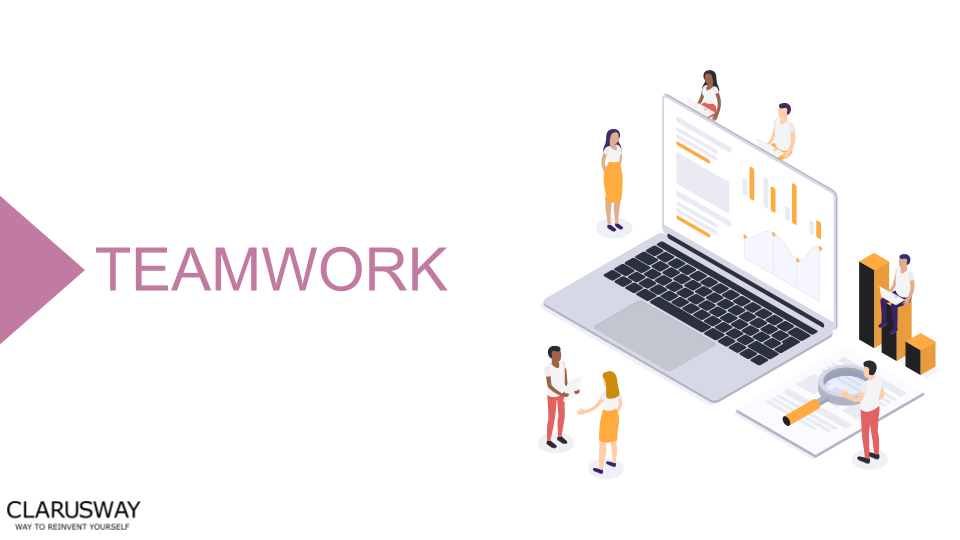

<h1><strong>STUDENT  VERSION (TW-1)</strong>

 
 
 
 
 
 

<h1><strong>Meeting Agenda</strong></h1>

▶ Icebreaking 

▶ Questions 

▶ Interview Questions

▶ Coffee Break

▶ Logical Reasoning Questions

▶ Video of the
week

▶ Retro
meeting

▶ Case study /
project

 
 
 

<h1><strong>Teamwork Schedule</strong></h1>

<table style= "width:100%;">
                <tr>
                <td style="color: #FA8072; text-align:left "><h3><strong>
Ice-breaking</td>
                <td style="color: #FA8072; text-align:right;"><h3><strong>
10m
<td>                </tr>
</table>

- Introduction.
- Personal Questions (Stay at home & Corona, 
Study Environment, Kids etc.) 
- Any challenges (Classes, Coding, studying, etc.) 
- Ask how they’re studying, give personal advice. 
- Remind that practice makes perfect. 

 
<table style= "width:100%;">
                <tr>
                <td style="color: #FA8072; text-align:left "><h3><strong>
Ask Questions</td>
                <td style="color: #FA8072; text-align:right;"><h3><strong>
15m
<td>                </tr>
</table>

 

**1. Which one is not an input device?**

<strong>A.</strong> Mouse 
<strong>B.</strong> Keyboard 
<strong>C.</strong> Scanner 
<strong>D.</strong> Spekar

 

**2. What is Cache RAM?**

<strong>A.</strong> Extra memory used for overflow from your Hard Disk 
<strong>B.</strong> A place to store secret information like passwords  
<strong>C.</strong> Fast memory used for data that is accessed often  
<strong>D.</strong> It is the same as your Hard Disk Drive

 

**3. What does a system bus do?**

<strong>A.</strong> Allows the user to communicate with the computer 
<strong>B.</strong> Connects various components within the computer 
<strong>C.</strong> Carries out instructions 
<strong>D.</strong> Stores data and instructions

 

**4. The ______ of a system includes the programs or instructions?**

<strong>A.</strong> Software 
<strong>B.</strong> Input 
<strong>C.</strong> Hardware 
<strong>D.</strong> Application

 

**5. Computers use the ______ number system to store data and perform calculations?**

<strong>A.</strong> Decimal 
<strong>B.</strong> Octal 
<strong>C.</strong> Binary 
<strong>D.</strong> Codes

 

**6. Python was created by ............?**

<strong>A.</strong> Steve Jobs 
<strong>B.</strong> Gecko 
<strong>C.</strong> Guido van Rossum 
<strong>D.</strong> James Gosling

 

**7. According to the PEP 8 coding style guidelines, how should constant values be named in Python?**

<strong>A.</strong> in camel case without using underscores to separate words -- e.g. maxValue = 255 
<strong>B.</strong> in lowercase with underscores to separate words -- e.g. max_value = 255 
<strong>C.</strong> in all caps with underscores separating words -- e.g. MAX_VALUE = 255 
<strong>D.</strong> in mixed case without using underscores to separate words -- e.g. MaxValue = 255

 

**8. Is Python case sensitive when dealing with identifiers?**

<strong>A.</strong> Yes 
<strong>B.</strong> Machine dependent  
<strong>C.</strong>  No 
<strong>D.</strong> None of the mentioned

 

**9. Which of the following is true for variable names in Python?**

<strong>A.</strong> All private members must have leading and trailing underscores 
<strong>B.</strong> Unlimited length 
<strong>C.</strong>	Underscore and ampersand are the only two special characters allowed 
<strong>D.</strong> None of the mentioned

 

**10. Which of the following is an invalid statement?**

<strong>A.</strong> abc = 1,000,000 
<strong>B.</strong> a b c = 1000 2000 3000  
<strong>C.</strong> a,b,c = 1000, 2000, 3000  
<strong>D.</strong> a_b_c = 1,000,000 

 

<table style= "width:100%;">
                <tr>
                <td style="color: #FA8072; text-align:left "><h3><strong>
Interview Questions</td>
                <td style="color: #FA8072; text-align:right;"><h3><strong>
15m
<td>                </tr>
</table>

**1. What is Python?**
 

 

**2. What is PEP 8 and why is it important?**

 

**3. Is indentation required in python?**

 

**4. What is an Interpreted language?**
 

 

**5. What are the primary components of a computer system?**
 

 

 :coffee: 
<table style= "width:100%;">
                <tr>
                <td style="color: #FA8072; text-align:left "><h3><strong>
Coffee Break</td>
                <td style="color: #FA8072; text-align:right;"><h3><strong>
10m
<td>                </tr>
</table>

:coffee:

 

<table style= "width:100%;">
                <tr>
                <td style="color: #FA8072; text-align:left 
"><h3><strong>
Logical Reasoning Questions</td>
                <td style="color: #FA8072; text-align:right;
"><h3><strong>
15m
<td>                </tr>
</table>

**1. Which word is the odd man out?**

<strong>A.</strong> Hate 
<strong>B.</strong> Fondness  
<strong>C.</strong> Liking
 
<strong>D.</strong> Attachment

 

**2. Meena's mother has five daughters: Reena, Teena, Sheena and Sheela. Who is the fifth daughter?**

 

**3. Before the days of motor cars, a man rode into town on his horse. He arrived on Sunday, spent three days in town and left on Sunday. How is that possible?**

 

 
<table style= "width:100%;">
                <tr>
                <td style="color: #FA8072; text-align:left "><h3><strong>
Video of the Week</td>
                <td style="color: #FA8072; text-align:right;"><h3><strong>
10m
<td>                </tr>
</table>

- [Coding is Not Difficult](https://www.youtube.com/watch?v=hb7Q33ysCwI&feature=youtu.be)

 

<table style= "width:97%;">
                <tr>
                <td style="color: #FA8072; text-align:left "><h3><strong>
Retro Meeting on a personal and team level</td>
                <td style="color: #FA8072; text-align:right;"><h3><strong>
10m
<td>                </tr>
</table>

Ask the questions below:

- What went well? 
- What could be improved? 
- What will we commit to do better in the next week? 

 

<table style= "width:105%;">
                <tr>
                <td style="color: #FA8072; text-align:left "><h3><strong>
Closing</td>
                <td style="color: #FA8072; text-align:right;"><h3><strong>
5m
<td>                   </tr>
</table>

- Next week’s plan

- QA Session 

